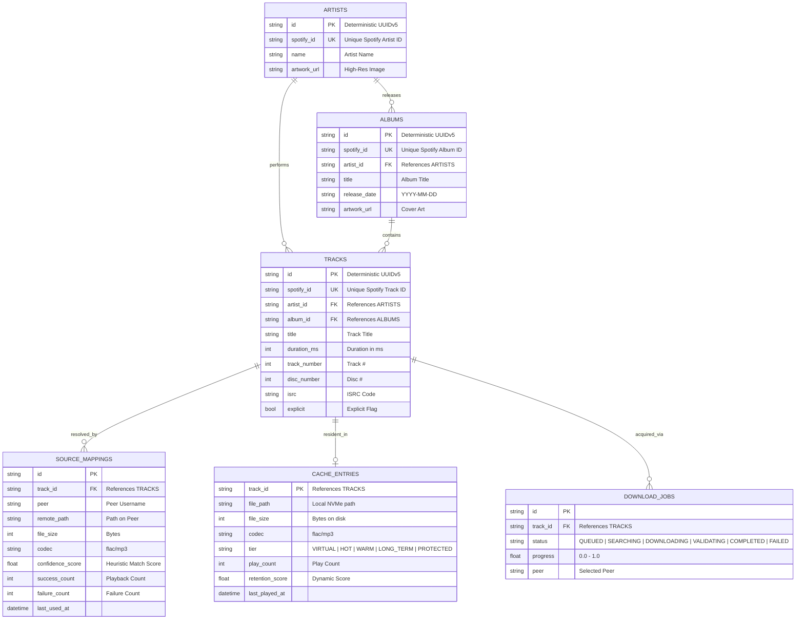

# Resono — Architecture Correction & Alignment Specification

## 1. Executive Summary & Context

During initial development, Resono achieved working milestones:
- Soulseek daemon integration, real-time distributed search, and response parsing.
- Exact recording matcher with multi-factor scoring (duration, artist, title, album folder, track number, audio codec/bitrate).
- Version disqualification filters (rejecting karaoke, covers, remixes, live bootlegs, nightcore, etc.).
- Asynchronous request deduplication and coalescing (`JobManager`).
- SQLite persistence in Write-Ahead Logging (WAL) mode.
- Automated pytest test suite passing 10/10 tests and live resolution validation.

However, two architectural deviations were introduced that must be corrected before proceeding to Jellyfin integration:
1. **Catalog Primary Provider:** The system used `ITunesProvider` as primary rather than `SpotifyProvider` (SpotAPI / Web Catalog).
2. **Audio Acquisition Backend:** The system connected to `slskd` rather than `slskr` (`snapetech/slskr`), and the matcher models were tightly coupled to `slskd` response schemas.

This document establishes the exact blueprint for aligning Resono with the target product vision while preserving and refactoring all existing, tested code.

---

## 2. Current Architecture vs. Target Architecture

```
CURRENT ARCHITECTURE (PROTOTYPE):
[Client/API Request]
        │
        ▼
[ITunesProvider (Primary)] ───> [iTunes Track Entity]
                                          │
                                          ▼
                                [slskd-Specific Matcher]
                                          ▲
                                          │
                            [slskd Response Candidate]
                                          ▲
                                          │
                                   [slskd Daemon]

─────────────────────────────────────────────────────────────────────────────

TARGET ARCHITECTURE (RESONO SPECIFICATION):
[Jellyfin Virtual Client]
        │
        ▼
[Resono Jellyfin Plugin (.NET 8)]
        │
        ▼
[Resono Gateway API (Python 3.12 / FastAPI)]
        │
        ├── Catalog Layer
        │     ├── SpotifyProvider (PRIMARY: SpotAPI / Web Catalog Token)
        │     ├── ITunesProvider (OPTIONAL FALLBACK / ENRICHMENT)
        │     └── MusicBrainzProvider (OPTIONAL CANONICAL ENRICHMENT)
        │
        ▼
[Canonical Track Model] (spotify:track:ABC123 ──> Deterministic UUIDv5)
        │
        ▼
[Exact Recording Matcher] (Backend-Neutral Heuristics & Rejection Engine)
        ▲
        │
[AudioCandidate Model] (Backend-Neutral Schema)
        ▲
        │
[slskr Adapter] (app/slskr/)
        ▲
        │
[slskr Rust Daemon] (snapetech/slskr)
        ▲
        │
[Soulseek P2P Network]
```

---

## 3. Detailed Architectural Deviations & Resolution

### Deviation 1: Catalog Provider (iTunes $\rightarrow$ Spotify Primary)
- **Deviation:** `ITunesProvider` was placed as the primary metadata source.
- **Why this conflicts:** The primary identity of all tracks, albums, and artists in Resono must be based on Spotify IDs (`spotify:track:...`, `spotify:album:...`, `spotify:artist:...`). Standard Jellyfin clients, playlists, and user favorites require deterministic GUIDs derived from Spotify IDs.
- **Resolution Plan:**
  1. Create `app/catalog/spotify.py` implementing `CatalogProvider`.
  2. Use public web catalog tokens (SpotAPI pattern: anonymous client token rotation without user login or scraping user credentials).
  3. Demote `ITunesProvider` to an optional fallback provider when Spotify public web endpoints are rate-limited or unavailable.
  4. Ensure all catalog models map to the unified `CanonicalTrack` schema.

### Deviation 2: Backend Coupling (`slskd` $\rightarrow$ `slskr` with Backend-Neutral Matcher)
- **Deviation:** `app/matcher/` consumed `SlskdFileCandidate` directly.
- **Why this conflicts:** The matcher is a core mathematical and heuristic subsystem. It must be completely agnostic of where audio files originate.
- **Resolution Plan:**
  1. Introduce `AudioCandidate` as a backend-neutral data contract in `app/core/models.py`.
  2. Refactor `ExactRecordingMatcher` to score `AudioCandidate` against `CanonicalTrack`.
  3. Re-target the daemon integration to `slskr` (`snapetech/slskr`) in `app/slskr/client.py`, addressing the root causes of the P2P connection timeouts identified during Phase 0 audit (correct network address binding, listen port mapping, and CIDR passthrough).
  4. Retain `app/slskd/client.py` as an alternative adapter implementing a shared `SoulseekBackend` interface so Resono supports both engines interchangeably.

---

## 4. Canonical Data Model Design

### 4.1 `CanonicalTrack` (Identity Invariant)
```python
class CanonicalTrack(BaseModel):
    canonical_id: str             # UUIDv5(Namespace_Resono, "spotify:track:" + spotify_id)
    spotify_id: str               # e.g. "3spdoDJUv5Qi09AfRyDu6q"
    artist_id: str                # e.g. "spotify:artist:3TVXtAsR1Inumwj472S9r4"
    album_id: str                 # e.g. "spotify:album:1ATL5GLyef8iki0V98Jbh9"
    title: str                    # e.g. "Controlla"
    artist_name: str              # e.g. "Drake"
    album_title: str              # e.g. "Views"
    duration_ms: int              # e.g. 245228
    track_number: int             # e.g. 11
    disc_number: int              # e.g. 1
    isrc: str | None = None       # e.g. "USUM71603099"
    release_date: str | None = None
    artwork_url: str | None = None
    explicit: bool = False
    metadata: dict[str, Any] = Field(default_factory=dict)
```

### 4.2 `AudioCandidate` (Backend-Neutral Source)
```python
class AudioCandidate(BaseModel):
    backend: str                  # "slskr" | "slskd"
    peer_id: str                  # Username or Peer Hash
    remote_path: str              # Full remote path on peer system
    filename: str                 # Extracted filename
    folder: str                   # Extracted immediate parent directory
    size_bytes: int               # File size in bytes
    duration_ms: int | None       # Extracted or inferred duration
    bitrate: int | None           # Bitrate in kbps (e.g. 320)
    codec: str                    # "flac" | "mp3" | "m4a" | "aac" | "ogg"
    sample_rate: int | None       # e.g. 44100
    is_locked: bool = False
    slots_free: bool = True
    queue_length: int = 0
    upload_speed: int = 0
    source_metadata: dict[str, Any] = Field(default_factory=dict)
```

---

## 5. Distinction: Heuristic Match vs. Cryptographic Identity

The previous test logged a match score of `1.0`. It is critical to establish the exact technical meaning of this score:
- **What a Score of 1.0 Means:** It indicates a **High-Confidence Exact Metadata Match**. Every observable heuristic dimension (artist token intersection, title token intersection, album folder similarity, exact duration match within $\le 2$ seconds, track number alignment, and lossless audio format) reached maximal confidence.
- **What it Does NOT Mean:** It does **not** represent a SHA-256 cryptographic identity or byte-level verification against a MusicBrainz AcoustID acoustic fingerprint.
- **Production Standard:** In Resono, the matcher is designed to avoid false positives by enforcing a strict threshold ($S \ge 0.82$) and disqualifying mismatched recordings (karaoke, covers, bootlegs). When no candidate meets this bar, Resono will return a controlled "No confident recording found" rather than playing a wrong song.

---

## 6. Revised Database Schema (SQLite + WAL)

The schema separates permanent identity from temporary audio residency:



### Key Schema Guarantee:
If `CACHE_ENTRIES` is deleted (evicted due to disk limits), `TRACKS`, `ALBUMS`, and `ARTISTS` remain 100% intact. User playlists and favorites in Jellyfin point to `TRACKS.id`, which never changes.

---

## 7. Migration & Refactoring Plan

### Step 1: Backend-Neutral Domain Contracts
- Define `CanonicalTrack`, `CanonicalAlbum`, `CanonicalArtist`, and `AudioCandidate` in `app/core/models.py`.
- Refactor `app/matcher/scoring.py` to evaluate `AudioCandidate` against `CanonicalTrack`.

### Step 2: Spotify Primary Catalog Provider (`app/catalog/spotify.py`)
- Implement `SpotifyProvider` using public web catalog token acquisition and Spotify Web API entity endpoints (`/v1/search`, `/v1/artists/{id}`, `/v1/albums/{id}`, `/v1/tracks/{id}`).
- Retain `ITunesProvider` as an automated fallback when Spotify web tokens are temporarily blocked or rate-limited.
- Implement memory and SQLite LRU caching for catalog queries.

### Step 3: slskr Dedicated Adapter (`app/slskr/`)
- Inspect `snapetech/slskr` network configuration to ensure it uses the main Soulseek cluster (`server.slsknet.org:2242`) and correct listening port bindings.
- Build `app/slskr/client.py` mapping slskr responses to the normalized `AudioCandidate` model.
- Preserve the existing `slskd` client as a secondary provider (`app/slskd/client.py`).

### Step 4: Jellyfin Integration Design
- **Virtual Item Mapping:** Jellyfin item IDs are generated using UUIDv5 with namespace DNS and input `"resono:track:" + spotify_id`.
- **Deterministic Virtual Library:** The Gateway exposes `.strm` directory stubs pointing to `http://resono-gateway:8080/playback/{track_id}`.
- **Server-Side User Data:** Play counts, last played dates, favorites, and playlists remain managed entirely by native Jellyfin database tables (`UserDataRepository`), synchronized across all Jellyfin iOS, Android, and Web apps.

---

## 8. Open Questions & Alignment Decisions

1. **SpotAPI / Public Token Scraping vs. Optional Client Credentials:**
   - *Recommendation:* Support both. Default to public web token scraping (zero credentials required), but allow users to optionally specify `SPOTIFY_CLIENT_ID` and `SPOTIFY_CLIENT_SECRET` in their `.env` if they prefer official API tokens with higher rate limits.
2. **slskr vs. slskd Runtime Strategy:**
   - *Recommendation:* Provide a unified `SoulseekBackend` interface. Implement `SlskrBackend` as primary, while keeping `SlskdBackend` available in the codebase as an instant fallback switch.
