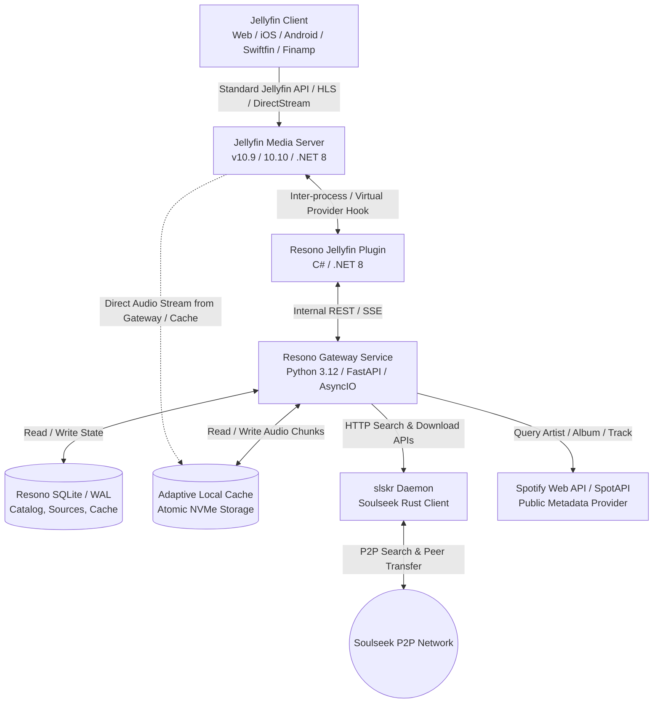
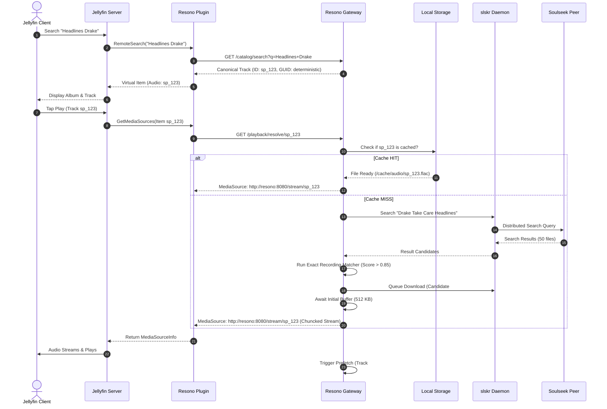

# Resono — System Architecture Specification

## 1. Executive Summary
**Resono** is an enterprise-grade, self-hosted virtual music platform that integrates Spotify's metadata catalog and Soulseek's decentralized peer-to-peer network (via `slskr`) into a seamless, native Jellyfin music streaming experience.

Resono separates **permanent catalog identity** from **temporary audio residency**:
- Virtual metadata (Artists, Albums, Tracks, Tracklists, Artwork, Playlists, Favorites) exists deterministically and permanently in Jellyfin.
- Audio media files are acquired on demand, streamed with near-zero latency, cached adaptively, and evicted without ever destroying Jellyfin item IDs, play counts, or playlist entries.

---

## 2. High-Level Architecture

---

## 3. Core Architectural Principles

### 3.1 Separation of Permanent Identity vs. Ephemeral Audio Residency
Every Spotify entity is mapped to a deterministic Jellyfin GUID using UUID v5 with a fixed namespace DNS:
$$\text{Jellyfin GUID} = \text{UUIDv5}(\text{Namespace}_{\text{Resono}}, \text{"spotify:track:"} + \text{track\_id})$$

Regardless of whether:
1. Audio has never been downloaded,
2. Audio is downloading in the background,
3. Audio is fully resident in the local cache,
4. Audio was evicted due to disk quota limits,
5. The Soulseek peer holding the file is offline,

**the Jellyfin Item ID, Favorites, Playlists, Play History, and User Data remain identical and invariant.**

### 3.2 Standard Jellyfin Client Compatibility
Resono does **not** introduce proprietary client-side apps or custom favorite/playlist sync databases. It targets 100% compliance with standard Jellyfin client contracts:
- **Favorites:** When an iOS user taps "Favorite", Jellyfin updates `UserDataRepository`. Android and Web immediately reflect the change. Resono listens to Jellyfin user events to boost the track's cache retention score.
- **Playlists:** Jellyfin playlist collections store Jellyfin Item IDs. Resono guarantees these IDs resolve to audio even years later via re-resolution.
- **Playback Tracking:** Native Jellyfin scrobbling, play counts, and resume points are maintained natively by the Jellyfin server.

---

## 4. Component Deep Dive

### 4.1 Resono Jellyfin Plugin (`Resono.Plugin.dll`)
Written in C# targeting `.NET 8.0` / Jellyfin Server API:
- **`ResonoSearchProvider`**: Intercepts library and remote music search queries; forwards them to the Gateway; returns virtual `Artist`, `MusicAlbum`, and `Audio` items.
- **`ResonoMetadataProvider`**: Supplies rich artist bios, album genres, release dates, track numbering, disc indices, and high-res cover art links.
- **`ResonoMediaSourceProvider`**: Dynamic provider implementing `IMediaSourceProvider`. When a virtual track is requested for playback, the plugin delivers a `MediaSourceInfo` pointing to the Resono Gateway's dynamic audio endpoint (`http://resono-gateway:8080/playback/{track_id}`).
- **`ResonoPlaybackTracker`**: Implements `IServerEvents` / `ISessionManager` listener to detect track playback start, progress, and finish, feeding telemetry to the Gateway's adaptive cache and prefetch scheduler.

### 4.2 Resono Gateway (`resono-gateway`)
Built with Python 3.12 and FastAPI for rapid metadata parsing, async networking, and resilient concurrency handling:
- **Catalog Manager:** Implements the `CatalogProvider` interface. Primary adapter is `SpotifyProvider` (using SpotAPI / public token scraping), backed by an SQLite cache and fallbacks (MusicBrainz, iTunes).
- **Identity Resolver:** Maps external IDs (Spotify, ISRC, MusicBrainz) to canonical Resono entities.
- **Exact Recording Matcher:** Applies an advanced multi-factor heuristic scoring engine to Soulseek search results to guarantee high audio fidelity and eliminate false matches (covers, karaoke, live bootlegs).
- **Request Deduplicator & Coalescer:** Collapses multiple concurrent playback/prefetch requests for the same track into a single in-flight resolution and download job.
- **Transfer & Playback Streamer:** Supports dual-mode playback:
  - *Mode 1 (Cache-Through Streaming):* Streams audio bytes to Jellyfin while simultaneously writing them into a verified cache file.
  - *Mode 2 (Local Cache Hit):* Direct zero-copy or HTTP range streaming from high-speed local disk storage.
- **Adaptive Cache Manager:** Enforces eviction policies, quota enforcement, and tier promotions.
- **Intelligent Prefetcher:** Analyzes album tracklists or playlist queues to pre-fetch subsequent tracks within a bounded concurrency window.

### 4.3 slskr Soulseek Daemon (`snapetech/slskr`)
Self-contained Rust/Web daemon connected to the Soulseek P2P network:
- Communicates exclusively over an internal Docker network (`resono-net`).
- Exposes REST APIs for search initiation, result retrieval, download queues, speed limits, and transfer status monitoring.
- Manages peer connections, slot queues, and distributed file transfers.

---

## 5. Data Flow & Playback Lifecycle

---

## 6. Exact Recording Matcher Heuristic

A Soulseek search result candidate is evaluated using a normalized scoring function $S \in [0.0, 1.0]$:

$$S = w_1 S_{\text{artist}} + w_2 S_{\text{title}} + w_3 S_{\text{album}} + w_4 S_{\text{duration}} + w_5 S_{\text{trackno}} + w_6 S_{\text{audio}}$$

### Scoring Parameters:
- **Artist Match ($w_1 = 0.25$):** Normalized token-set Levenshtein distance.
- **Title Match ($w_2 = 0.25$):** Strict title match with punctuation stripping.
- **Album Match ($w_3 = 0.15$):** Compares folder hierarchy and ID3 metadata tag against canonical album.
- **Duration Match ($w_4 = 0.20$):**
  - $|\Delta t| \le 2\text{s}$: 1.0
  - $2\text{s} < |\Delta t| \le 5\text{s}$: 0.7
  - $5\text{s} < |\Delta t| \le 10\text{s}$: 0.3
  - $|\Delta t| > 10\text{s}$: Automatic disqualification (Penalty -1.0)
- **Track & Disc Number ($w_5 = 0.10$):** Inferred from filename prefix (e.g. `03 - Headlines.mp3`) or metadata.
- **Audio Quality Preference ($w_6 = 0.05$):** Bitrate $\ge 320\text{ kbps}$ or FLAC lossless preferred over low-bitrate rips.

### Strict Disqualifications (Immediate Reject):
- Presence of unwanted markers in candidate string:
  `["karaoke", "cover", "tribute", "live", "remix", "radio edit", "instrumental", "acoustic", "sped up", "slowed", "nightcore", "demo", "mashup", "re-recorded"]`
  *(unless explicitly requested in canonical title)*.
- Candidate confidence threshold: **Minimum acceptance score is 0.82**. Any score below this returns an honest "No confident source found" rather than playing a wrong recording.

---

## 7. Adaptive Cache & Eviction Architecture

### 7.1 Cache Tiers
1. **`VIRTUAL`**: Pure metadata entry in SQLite and Jellyfin. Consumes 0 bytes of audio disk space.
2. **`HOT`**: Newly acquired track or actively playing track. Retained unconditionally for at least 72 hours.
3. **`WARM`**: Repeatedly played track within 14 days. Eligible for background re-verification.
4. **`LONG_TERM`**: Regularly listened track across weeks or part of an active playlist.
5. **`PROTECTED`**: Favorited tracks in Jellyfin or marked "offline/pinned" by the user. Eviction immune unless disk is 100% exhausted and forced by admin.

### 7.2 Retention Score Formula
When cache disk usage exceeds `max_cache_size_gb` or free disk drops below `minimum_free_disk_gb`:
$$\text{Retention Score} = (\text{PlayCount} \times 10) + \text{RecencyBonus} + (\text{IsFavorite} \times 1000) + (\text{PlaylistCount} \times 20) - \left(\frac{\text{FileSizeBytes}}{10 \times 1024^2}\right)$$
Tracks with the lowest retention score are evicted first. Eviction performs an `unlink()` of the audio file and updates `cache_entries.status = 'VIRTUAL'`. The canonical track record and Jellyfin item remain untouched.

---

## 8. Database Schema Overview (SQLite + WAL)

The Resono Gateway maintains local state in `resono.db`:
- **`artists`**: Canonical artist UUID, Spotify ID, name, bio, image URLs.
- **`albums`**: Canonical album UUID, Spotify ID, artist UUID, title, year, total tracks, cover art.
- **`tracks`**: Canonical track UUID, Spotify ID, album UUID, artist UUID, title, duration_ms, disc_no, track_no, isrc.
- **`source_mappings`**: Historical Soulseek peer, path, file size, bitrate, format, confidence score, success count, failure count.
- **`cache_entries`**: Track UUID, local file path, format, file size, tier (`HOT`, `WARM`, `LONG_TERM`, `PROTECTED`), last_played_at, play_count, retention_score.
- **`playback_jobs`**: Active and queued resolution/download jobs, attached HTTP listener channels, transfer progress.
- **`peer_reputation`**: Soulseek username, average transfer speed, timeout counts, ban status.
